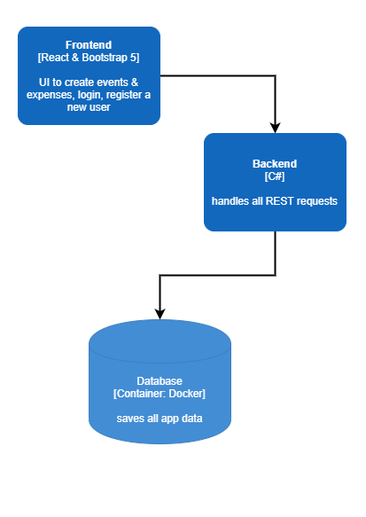

# Expenses - a .NET 5 & React Sample Application

The main purpose of this repository is to experiment with some technologies. Get them to know and how to use them. Furthermore we've tried to follow DDD and implemented the CQRS pattern in the REST api.

## Motivation and purpose

There are a lot of sample applications around showing CQRS, DDD and other patterns. But there's no application which uses some real business logic or is a bit more complex. That's why we've tried our luck developing expenses.

**Expenses**: An application to track costs for an event, e.g. vacation for several people. At the end of the event, everyone gets a listing of a transfer they have to make to someone else.

## System Architecture

At the moment it's just a frontend and a backend service. There are already plans to split the backend into more services.



## Getting started

Interested to contribute to this project and not sure where to start? Please follow the [Setup a dev environment guide](##Setup-a-dev-environment-guide) for environment setup or knowing repository structure. If you stuck anywhere or need any help, feel free to create an `Issue` for discussion.

## Deployment

At the moment we've deployed the app for testing purposes on Azure. In general it doesn't matter where you want to deploy the app.

## Technology stack & Tools

- Docker
- AutoMapper
- FluentValidation
- SwashBuckle
- Bootstrap 5
- React
- NodeJS
- .NET 5
- EF Core Framework

## Want to Contribute?

Your valuable contribution is always welcome to keep this repository up to date and relevant. If you have some cool idea or new features requirement, please feel free to open a Github issue.

## Setup a dev environment guide

### Prerequsites

Before proceeding with setup, make sure you have following tools installed in your machine:

- NodeJS v12+
- Docker
- .NET

NOTE: Please refer to official installation guide for above tools installation.

### Code Checkout

Clone the source code from this Github repository:

```bash
git clone https://github.com/mperator/expenses.git
```

Open the code in Visual Studio Code:

```bash
cd expenses
code .
```

### Understanding Directory Structure

Once you open the code in VS Code, you shoud see following structure:

```folders
microservices-reference-application/
├── .github/                            -> Github actions CI/CD config
├── backend/                            -> backend source code (C#)
│   ├── Expenses.Api/                   -> source folder api layer
│   ├── Expenses.Application/           -> source folder application layer
│   ├── Expenses.Domain/                -> source folder domain layer
│   ├── Expenses.Domain.Tests/          -> source folder unit tests domain layer
│   ├── Expenses.Infrastructre/         -> source folder infrastructre layer
│   ├── Expenses.Infrastructre.Tests/   -> source folder unit tests infrastructre layer
│   ├── Expenses.Api.sln                -> Visual Studio Solution file
│   ├── .gitignore                      -> Git ignore file
├── frontend/ 
│   ├── .vscode/                        -> VS code files for debugging
│   ├── public/                         -> static files
│   ├── src/                            -> source folder
│   ├── .gitignore                      -> Git ignore file
│   ├── package-lock.json               -> Package JSON lock file
│   ├── package.json                    -> Package JSON file
├── docs/                               -> documentation folder
│   ├── images/                         -> image folder used in global readme.md
├── Dockerfile                          -> Dockerfile for containerization
└── readme.md                           -> Global Readme file
```

### Running the app

We've developed and tested the app using SQL Server 2019. How to setup SQL Server 2019 in docker you can read [here](https://www.michalbialecki.com/2020/04/23/set-up-a-sql-server-in-a-docker-container/).

Adjust your `appsettings.json` inside the backend folder:

```bash
"ConnectionStrings": {
    "Test": YOUR_CONNECTION_STRING
}

"JwtToken": {
    "SecretKey": "dmEPcQ%MU^B&tWTNU67gb,:t?:n*Y+Ms",    // you can adjust this as you want
    "Issuer": "Expenses.Api",                           // you can adjust this as you want
    "Audience": "Expenses.Api",                         // you can adjust this as you want
    "AccessTokenExpiryTimeInSeconds": 900,              // you can adjust this as you want
    "RefreshTokenExpiryTimeInSeconds": 1209600          // you can adjust this as you want
  },


```

Once database is up, you can go to backend and frontend directory and excute following command to start the app:

```bash
# Run backend
cd backend
dotnet restore
dotnet run dev
```

```bash
# Run frontend
cd frontend
npm i
npm start

# open your browser and navigate to:
http://localhost:5001/dashboard
```
